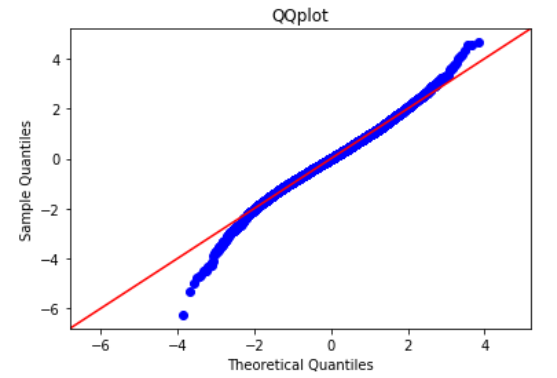
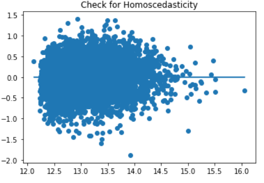

# Linear-Regression-Project
## Overview and Purpose
For this project I want to know what features of a house like location, number of bedrooms, size, etc. impact the price of the house so that I can make the most strategic choices when building a house in King County.
To do this I will create a linear regression model to predict the price increase or decrease of a house in King County, based on specific features. 
King County includes the city of Seattle and is the most populous county in Washington State.  

## The Data
The data used is King County housing data provided by Flatiron School.
There are 21,597 houses included in this data and the prices range from $78,000 to $7,700,000.

### Definitions of Key Features Used:
    Date - house was sold
    Price - is prediction target
    bedrooms - of Bedrooms/House
    sqft_living - footage of the home
    sqft_lot - footage of the lot
    waterfront - House which has a view to a waterfront
    view - Has been viewed
    grade - overall grade given to the housing unit, based on King County grading system
    sqft_basement - square footage of the basement
    zipcode - zip
    sqft_lot15 - The square footage of the land lots of the nearest 15 neighbors
*A ‘basement’ column was created from the sqft_basement data to indicate whether or not a home had a basement*

## Exploratory Data Analysis
### Scatter Plot Matrix

The plot above gives me a lot of information. I can see which variables, with price on the y axis, may have linear relationships with price. 
I can also look on the diagonal and see histograms showing the distribution for each of the variables.
I can see that variables like grade are very close to normally distributed
Price, bedrooms, bathrooms, sqft_living all look to be right skewed
On initial look, the variables with potential linear relationships with price are, bedrooms, sqft_living, sqft_living15, grade

### Multicollinearity 

The lighter regions of the heatmap above indicate which features are the most correlated. The table also helps to show which features are correlated. It looks like sqft_living, sqft_above, and grade are the most correlated.

### Continuous Variables
Two variables I wanted to highlight and check for linearity in my analysis were sqft_living and sqft_lot. The two graphs below indicate potential linear relationships between price and the two variables. I can also see that for both variables their distributions are skewed to the right

Home Size Vs. Price

Lot Size Vs. Price

### Categorical Variables
For my analysis I wanted to see how variables like grade, number of bedrooms, zipcode, and basement were affected by price. In the four graphs below I can see the distributions of each variable against price. All the variables look to be at least moderately impacted by price. 

## Baseline Model 
Snapshot of the first model run:

The first run of the model resulted in  an R-squared value of .83 and an RMSE of 151374.63. It is clear that despite the high R-squared value, the corresponding high RMSE and the features with high p-values make the model not a good fit.

## Iterative Process
* I began my modeling process by removing all features with a p-value greater than .05

* Then I log transformed Price to help normalize the data 

* I did more rounds of removing features with high p-values

* Then I dealt with multicollinearity and removed highly correlated features.

* Many features were correlated which led me to remove a lot of features, which ultimately dropped the R-squared value significantly

* I log transformed my continuous variable features

* Finally, I did one more round of dropping features with high p-values

## Final Model 
Snapshot of the final model run:

The final (log-transformed) RMSE of the model is .302 The final R-squared is .670. Though the R-squared is lower than the original model, all the feature p-values are 0 and the RMSE is relatively low.

## Interpretation
### Linear Model Assumptions

Due to the log transformations, the data in the model follow the normality line relatively well, although not perfectly

Homoscedasticity is not perfectly met with this data. This indicates that a linear regression model may not be the best model for the data

### R-squared, RMSE, and Coefficients
* R-squared - .670, higher R-squared values represent smaller differences in the observed data and the fitted values created by the model

* RMSE - The average error of the model is about 1.35 dollars of log price.

* Key Coefficients:
    * As lot size increases by 1%, price increases .1274%. For every 20% increase in lot size price increases 2.35%

    * Having a waterfront property increases log price by $1.53

    * Having a basement increases log price by $1.07

    * Having 5 bedrooms increases log price by $1.20 and 7 bedrooms increases log price by $1.22

    * Having a high grade of 13 increases log price by $2.63

  * The zipcodes with the highest log price increase are 98004 at $3.87 , 98039 at $5.12, 98112 at $3.60

## Conclusions
A linear model may not be the best model for this data.

However, I can see that waterfront properties and properties in certain areas increase the price of the house. The zipcodes that increased price the most included Seattle, a major city, and waterfront neighborhoods.

More bedrooms increase price, but past 5 bedrooms the increase is small.

Having a high grade, based on the King County grading system, is very important. Looking into the grading system will be key when building a house.

Perhaps building a house with a larger lot size and including a basement, in a less expensive zipcode may be beneficial to increase value of the house without the extreme cost certain neighborhoods entail.

## Next Steps
Further analysis in exploring interactions between data such as lot size and the land lots of the nearest 15 neighbors could be helpful.

Integrating polynomial regression may help create a model with a better fit. 

Further understanding of what features affect the grading system in King County could help analysis and strategy when building a house in the area.

